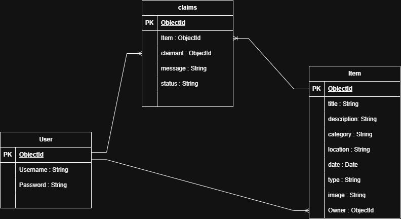

README Structure:

# Project Name
Lost Items Website

## Overview
Campus Lost & Found is a web application designed to help students report, find, and recover lost items on campus. Users can create accounts, post lost or found items, view item details, and submit claims for items they believe belong to them. Item owners can manage their posted items and review claims submitted by other users.

## Screenshots

## Technologies Used
- Node.js
- Express.js
- MongoDB
- Mongoose
- EJS
- JavaScript
- CSS

## Getting Started

## User Stories
1. As a user, I want to create an account and sign in so that I can use the application.

2. As a signed-in user, I want to create a lost or found item so that I can add it to the platform.

3. As a user, I want to view all lost and found items so that I can look for an item.

4. As a user, I want to view the details of an item so that I can see more information about it.

5. As an item owner, I want to edit my item so that I can update its information.

6. As an item owner, I want to delete my item so that it is no longer displayed.

7. As a user, I want to submit a claim for an item so that I can explain why I believe it belongs to me.

8. As an item owner, I want to receive claims for my item so that I can review them.

## Database Design
1. Lost Items ERD

## Routes

## Features

## Future Enhancements

## Credits