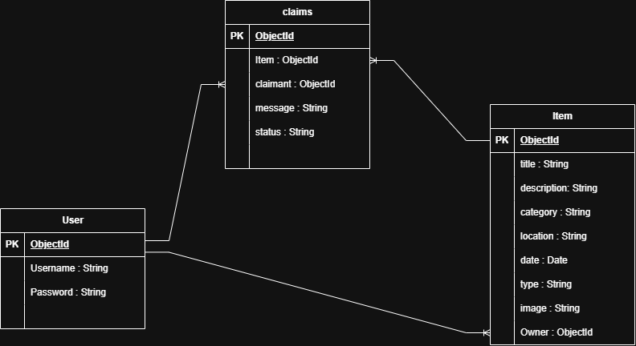

README Structure:
# Campus Lost & Found
A web application that helps students report, find, and recover lost items on campus.


## Overview
Campus Lost & Found lets users create accounts, post lost or found items with photos, browse everything reported so far, and submit claims for items they believe belong to them. Item owners can manage their own listings and approve or reject incoming claims. Admins get a separate dashboard with system statistics and an overview of all users, items, and claims. Any item can also be exported as a formatted PDF.

## Screenshots

## Technologies Used
**Backend**
- Node.js
- Express.js
- MongoDB and Mongoose
- express-session with connect-mongo (sessions stored in MongoDB)
- bcrypt (password hashing)
- Multer (image uploads)
- PDFKit (PDF generation)
- method-override, morgan, dotenv

**Frontend**
- EJS
- Bootstrap 5 and Bootstrap Icons
- Custom CSS
- Inter (Google Fonts)


## Getting Started

Follow these steps to run the project locally.

### 1. Clone the Repository

```bash
git clone https://github.com/Sayed-2003/Lost-Items.git
```

Then move into the project folder:

```bash
cd Lost-Items
```

### 2. Install Dependencies

```bash
npm i
```

### 3. Set Up Environment Variables

Create a `.env` file in the root directory of the project and add:

```env
MONGODB_URI=your_mongodb_connection_string
SESSION_SECRET=your_session_secret
PORT=3000
```

Replace the values with your own MongoDB connection string and session secret.

**Important:** Never upload your `.env` file to GitHub. Make sure it is listed in `.gitignore`.

### 4. Create the Uploads Folder

Item images are saved to `public/uploads`. Create the folder if it does not exist:

```bash
mkdir -p public/uploads
```

### 5. Start the Application

```bash
nodemon server.js
```

Or, without nodemon:

```bash
node server.js
```

### 6. Open the Application

Once the server is running, open your browser and go to:

```text
http://localhost:3000
```

The Campus Lost & Found application should now be running.

### Creating an Admin

Every new account is created with the `user` role. To create an admin, change the `role` field of a user to `admin` directly in your MongoDB database. Admins will see an **Admin Dashboard** link in the navbar.

## Requirements

Before running the project, make sure you have:

- [Node.js](https://nodejs.org/) installed
- npm installed
- A MongoDB database (local or Atlas)
- Git installed

## Project Structure

```text
├── middleware/     # Auth guards, user-to-view helper, Multer upload config
├── models/         # Mongoose models: User, Item, Claim
├── public/         # Static files (CSS, uploaded images)
├── routes/         # Express routers: index, auth, items, claims, admin
├── utils/          # PDF generation helper
├── views/          # EJS templates (admin, auth, claims, items, partials)
├── db.js           # MongoDB connection
└── server.js       # App entry point
```

## User Stories
1. As a user, I want to create an account and sign in so that I can use the application.

2. As a signed-in user, I want to create a lost or found item so that I can add it to the platform.

3. As a user, I want to view all lost and found items so that I can look for an item.

4. As a user, I want to view the details of an item so that I can see more information about it.

5. As an item owner, I want to edit my item so that I can update its information.

6. As an item owner, I want to delete my item so that it is no longer displayed.

7. As a user, I want to submit a claim for an item so that I can explain why I believe it belongs to me.

8. As an item owner, I want to receive claims for my item so that I can review them.

9. As a user, I want to download an item's details as a PDF so that I can print or share it.

10. As an admin, I want a dashboard with statistics and lists of users, items, and claims so that I can monitor the system.

## Database Design
1. Lost Items ERD



## Routes

### Index

| Method | Route | Description |
|--------|-------|-------------|
| GET | `/` | Render homepage |

### Auth

| Method | Route | Description |
|--------|-------|-------------|
| GET | `/auth/sign-up` | Render sign-up form |
| POST | `/auth/sign-up` | Create a new user |
| GET | `/auth/sign-in` | Render sign-in form |
| POST | `/auth/sign-in` | Authenticate user and start session |
| GET | `/auth/sign-out` | Destroy session and sign out |

### Items

| Method | Route | Description |
|--------|-------|-------------|
| GET | `/items` | Redirect to all items |
| GET | `/items/create` | Render create-item form *(auth required)* |
| POST | `/items/create` | Create a new item with image upload *(auth required)* |
| GET | `/items/all-items` | Display all non-deleted items |
| GET | `/items/:id` | Display a single item's details *(auth required)* |
| GET | `/items/:id/pdf` | Download a PDF for an item |
| GET | `/items/:id/edit` | Render edit form for an item *(auth + owner required)* |
| PUT | `/items/:id` | Update an item *(auth required)* |
| DELETE | `/items/:id` | Soft-delete an item *(auth + owner required)* |

### Claims

| Method | Route | Description |
|--------|-------|-------------|
| GET | `/claims/create/:itemId` | Validate a claim for an item *(auth required)* |
| POST | `/claims/create/:itemId` | Submit a claim on an item *(auth required)* |
| GET | `/claims/requests` | View pending claims on items you own *(auth required)* |
| PUT | `/claims/:id/accept` | Approve a claim *(auth required)* |
| PUT | `/claims/:id/reject` | Reject a claim *(auth required)* |
| GET | `/claims/my-claims` | View claims you've submitted *(auth required)* |

### Admin

| Method | Route | Description |
|--------|-------|-------------|
| GET | `/admin/dashboard` | Statistics and pending claims *(admin only)* |
| GET | `/admin/users` | List all users and roles *(admin only)* |
| GET | `/admin/items` | List all non-deleted items *(admin only)* |
| GET | `/admin/claims` | List all claims and their statuses *(admin only)* |

## Features

- User registration and sign-in with hashed passwords
- Session-based authentication (sessions stored in MongoDB)
- Role-based access control (user and admin)
- Create lost and found item listings
- Upload images for items
- View item details
- Edit and delete your own items (soft delete)
- Submit claims for items, with protection against claiming your own item, duplicate claims, and already-claimed items
- View your submitted claims and their status
- View claims for your own items
- Approve or reject claims
- Download a styled PDF for any item
- Admin dashboard with total users, items, claims, and pending claims
- Admin pages to view all users, items, and claims
- Responsive UI built with Bootstrap 5
- Sign out


## Future Enhancements
- Search and filter items by type, category, location, and date
- Pagination on the items list
- Input validation and friendly error pages
- Email or in-app notifications when a claim is approved or rejected
- Admin actions: change roles, remove items, and manage claims
- Automatically reject other pending claims when one is approved
- Unique filenames for uploaded images

## Credits
- thanks to **OMAR KAMAL** for the help in this Project
- [Bootstrap](https://getbootstrap.com/) and [Bootstrap Icons](https://icons.getbootstrap.com/)
- [Inter](https://fonts.google.com/specimen/Inter) font by Google Fonts
- [PDFKit](https://pdfkit.org/)
- [Multer](https://www.geeksforgeeks.org/node-js/multer-npm/) (image uploads)